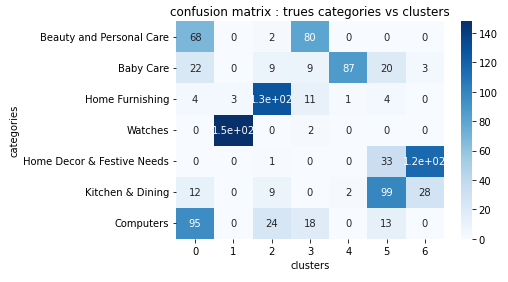

# 🛍️ **AutoClassifier**: Multi-modal Product Categorization Engine

 <!-- Placeholder image for context -->

## 🏢 **Project Overview**

This project aims to develop an **automatic product classification engine** that leverages both textual and visual data to categorize e-commerce products efficiently. By combining cutting-edge feature extraction techniques, this project demonstrates the feasibility of creating a scalable, multi-modal classification system to streamline product organization in large marketplaces.

### **Why is this important for businesses?**
Efficient product categorization is a critical aspect of managing large-scale e-commerce platforms. A robust classification engine can:
- **Improve Search and Discovery**: Accurately categorized products make it easier for customers to find what they need, enhancing the shopping experience.
- **Streamline Inventory Management**: Automating the classification process reduces manual effort and minimizes errors in organizing thousands of products.
- **Enable Personalized Recommendations**: Well-structured product categories improve the effectiveness of recommendation algorithms, driving customer engagement and sales.
- **Scale Operations**: A scalable classification system allows businesses to handle growing inventories without proportionally increasing operational costs.

---

## 🎯 **Objectives**

- **Primary Goal**: Build a robust, automatic engine for product categorization based on text and image features.  
- **Secondary Goal**: Evaluate the performance of individual feature modalities (text vs. images) and explore multi-modal fusion techniques.  

---

## 📊 **Data Sources**

- **Main Dataset**: [Flipkart Product Dataset](https://www.kaggle.com/datasets/PromptCloudHQ/flipkart-products)  
- **Key Variables**:  
  - **Text**: Product descriptions (e.g., "Baby stroller with ergonomic design").
       <!-- Placeholder image for context -->  
  - **Images**: Product photos in JPEG format.
       <!-- Placeholder image for context -->  

---

## 📁 **Project Structure**

This project is divided into two main phases:

1. **Text Feature Extraction**:
   - **Approaches**: TF-IDF, Word2Vec, BERT, and Universal Sentence Encoder (USE).  
   - **Best Result**: TF-IDF achieved the highest ARI score of **0.503**, outperforming contextual models.  

2. **Image Feature Extraction**:
   - **Approaches**: SIFT (classical method) and CNN-based transfer learning (e.g., VGG-16).  
   - **Best Result**: VGG-16 achieved an ARI score of **0.3876**, validating the strength of deep learning features.  

3. **Multi-Modal Fusion**:
   - Combined TF-IDF and VGG-16 features. Results were inconclusive, highlighting challenges in aligning text and image modalities effectively.

---

## 🔬 **Methodology**

### Phase 1: Text Feature Extraction  
- **Techniques**:  
  - TF-IDF: Captured term importance within product descriptions.  
  - Contextual Models (Word2Vec, BERT, USE): Explored semantic embeddings for improved clustering.  

- **Results**: TF-IDF performed best with an ARI of **0.503**, demonstrating its strength in distinguishing product categories based on textual descriptions.
  
     > **Note**: The confusion matrix shows strong performance for **"Watches"**, **"Home Furnishing"** and **Home Decor.."**, while categories like **"Beauty and Personal Care"** exhibit overlaps due to textual similarities.

### Phase 2: Image Feature Extraction  
- **Techniques**:  
  - **SIFT**: Classical keypoint detection method.  
  - **VGG-16**: Pre-trained CNN used for transfer learning and feature extraction.  

- **Results**: VGG-16 outperformed SIFT (ARI: **0.3876**), showcasing the superiority of deep learning in extracting global visual patterns.
    
  > **Note**: The confusion matrix highlights strong performance for **"Watches"** and **"Home Decor & Festive Needs"**, while categories like **"Beauty and Personal Care"** show overlaps, likely due to visual similarities between products.

### Phase 3: Multi-Modal Fusion  
- **Technique**: Combined TF-IDF and VGG-16 features through feature concatenation.  
- **Results**: Poor clustering performance (ARI: **-0.0003**), likely due to feature incompatibility and lack of a robust fusion strategy.  

---

## ✅ **Results**

### Key Observations:  
1. **Text Outperforms Images**:  
   - TF-IDF provided the highest classification accuracy, indicating text features are more discriminative for this dataset.
     
2. **Challenges with Visual Features**:  
   - While VGG-16 showed promise, categories with subtle visual differences (e.g., "Beauty and Personal Care" vs. "Baby Care") remained difficult to separate.

3. **Fusion Complexity**:  
   - Combining text and image features requires advanced techniques (e.g., weighted combinations or attention mechanisms) to align modalities effectively.

---

## 🏆 **Feasibility Validation**

This project successfully demonstrates the **feasibility** of building an automated classification engine for e-commerce product categorization. Key findings include:
- **Text-based features** (TF-IDF) provide a solid baseline for accurate categorization.
- **Visual features** (VGG-16) offer complementary information, particularly for categories with strong visual distinctions.

However, to achieve higher precision and better performance, **optimization** will be critical. Improvements in feature fusion techniques, fine-tuning of pre-trained models, and leveraging additional metadata will be essential for practical deployment.

---

## 🚀 **Potential Business Impact**

This project provides a blueprint for implementing an automated, scalable classification engine for e-commerce platforms. By adopting this approach, businesses can:
- **Reduce Operational Costs**: Automating categorization minimizes manual labor and reduces errors.
- **Enhance Customer Experience**: Accurate categorization ensures customers find products faster, boosting satisfaction and loyalty.
- **Optimize Marketing Strategies**: Categorized data improves the precision of recommendation systems, leading to higher conversion rates and sales.
- **Enable Global Scalability**: A robust engine can handle rapidly growing inventories and support expansion into new markets.

---

## 🚀 **Potential Improvements**

1. **Fine-Tuning**:
   - Fine-tune pre-trained CNNs like VGG-16 on the dataset to improve domain-specific visual feature extraction.  

2. **Multi-Modal Fusion**:
   - Explore advanced techniques such as attention mechanisms, multi-modal embeddings, or ensemble methods to better integrate text and image features.  

3. **Additional Features**:
   - Incorporate other metadata (e.g., price, reviews) for richer categorization.

4. **Supervised Learning**:
   - Transition to supervised models to leverage labeled data and achieve better classification accuracy.

---

## 📫 **Contact**

**Alexis Marceau**  
📧 [alexis.marceau.12@gmail.com](mailto:alexis.marceau.12@gmail.com)  
🔗 [LinkedIn](https://www.linkedin.com/in/alexis-marceau)
